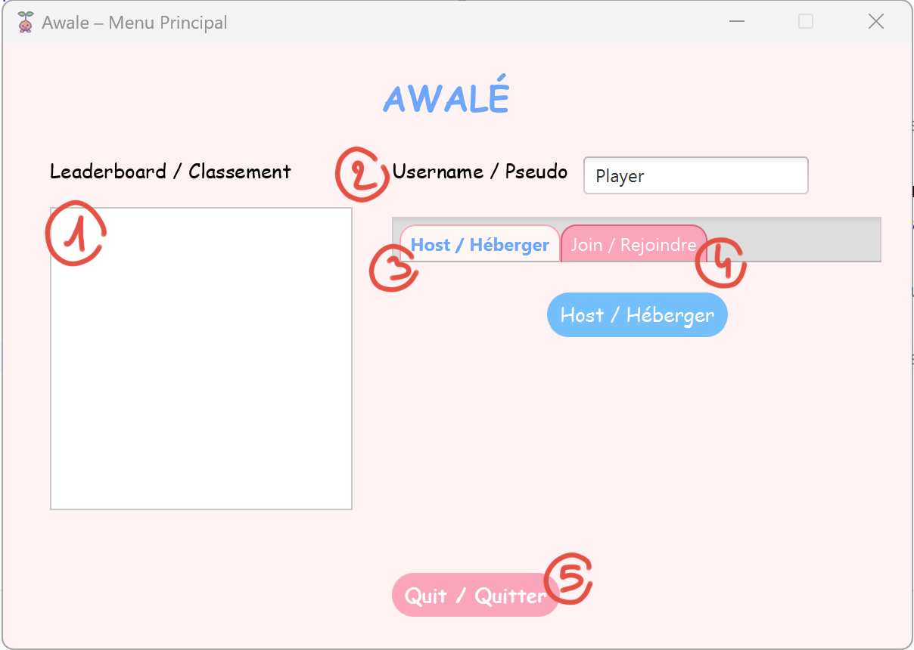
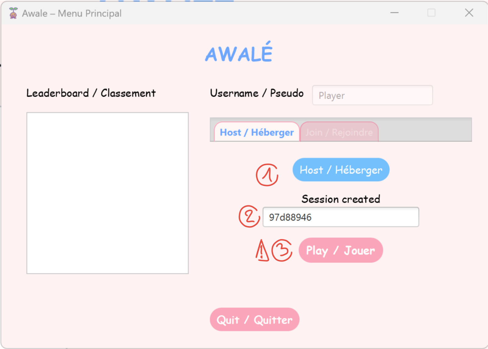
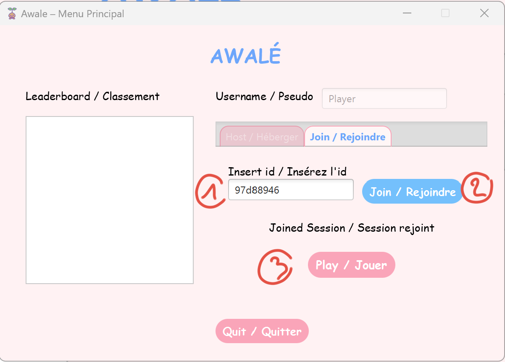
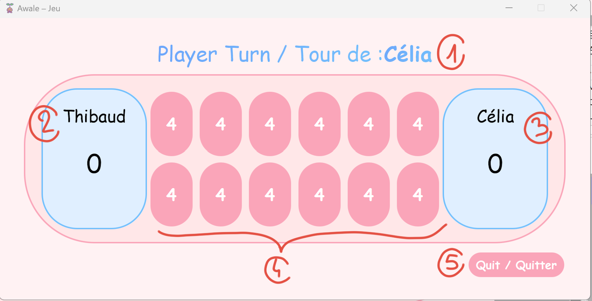

# Awalé JavaFX Project

- [English](#english-documentation)
- [Français](#documentation-francaise)

---

## English documentation

### Usage

#### 1. Main Screen

* **Username**
  Enter your nickname before starting (the default one is 'Player').
* **Leaderboard**
  View top scores to challenge yourself.
* **Host**
  Switch to the host tab to start a session.
* **Join**
  Switch to the join tab to enter a session ID.
* **Quit**
  Exit the application.

#### 2. Host

1. Click **Host** to open a new session.
2. Share the displayed session ID with your opponent.
3. Once they’ve joined, click **Play** to start.

#### 3. Join

1. Enter the session ID provided by the host.
2. Click **Join**.
3. After connecting, click **Play** to begin.

#### 4. Game Screen

* **Current Player**
  Shows who has the move.
* **Scores**
  Displays each player’s captured seeds.
* **Board**
  12 pits with 48 seeds; sow counter-clockwise following Awalé rules.
* **Exit**
  Leave the game at any time.

---

### Deployment

#### Prerequisites

* Java Development Kit 17 (JDK 17) installed.
* IntelliJ IDEA or another Java IDE.

#### Deployment Steps

1. **Open Project**

   * Launch IntelliJ IDEA and select **Open**.
   * Choose the project root folder; wait for Gradle to finish.
2. **Configure Java**

   * In *Project Structure*, set the SDK to JDK 17 if needed.
3. **Server Setup**

   * (Optional) Edit `resources/server.properties` to change `server.port` (default 8080).
   * Run the **Server** module via Gradle task `Server:run` or `java -jar`.
4. **Client Setup**

   * (Optional) Edit `resources/client.properties` to set `server.host` (default localhost) and `server.port`.
   * Run the **Client** module via Gradle task `Client:run`.

The game window should appear once both server and client are running.

---

## Documentation francaise

### Manuel d'Utilisation

#### 1. Écran principal

* **Pseudo**
  Entrez votre pseudo avant de commencer (le défaut est 'Player').
* **Classement**
  Consultez les meilleurs scores pour vous challenger.
* **Héberger**
  Passez à l'onglet héberger pour démarrer une partie.
* **Rejoindre**
  Passez à l'onglet rejoindre pour saisir un ID de session.
* **Quitter**
  Fermez l'application.

#### 2. Héberger

1. Cliquez sur **Héberger** pour ouvrir une nouvelle session.
2. Partagez l'ID de session affiché avec votre adversaire.
3. Une fois qu'il a rejoint, cliquez **Jouer** pour démarrer.

#### 3. Rejoindre

1. Saisissez l'ID de session fourni par l'hôte.
2. Cliquez **Rejoindre**.
3. Après la connexion, cliquez **Jouer** pour commencer.

#### 4. Écran de jeu

* **Joueur actif**
  Indique qui joue.
* **Scores**
  Affiche les graines capturées par chaque joueur.
* **Plateau**
  12 cases et 48 graines; distribuez dans l'ordre anti-horaire selon les règles de l'Awalé.
* **Quitter**
  Quittez la partie à tout moment.

---

### Manuel de Déploiement

#### Prerequisites

* Java Development Kit 17 (JDK 17) installé.
* IntelliJ IDEA ou un autre IDE Java.

#### Étapes de déploiement

1. **Ouvrir le projet**

   * Lancez IntelliJ IDEA et sélectionnez **Open**.
   * Choisissez le dossier racine du projet ; attendez la fin de Gradle.
2. **Configurer Java**

   * Dans *Project Structure*, définissez le SDK sur JDK 17 si nécessaire.
3. **Configuration du serveur**

   * (Optionnel) Modifiez `resources/server.properties` pour changer `server.port` (8080 par défaut).
   * Exécutez le module **Server** via la tâche Gradle `Server:run` ou `java -jar`.
4. **Configuration du client**

   * (Optionnel) Modifiez `resources/client.properties` pour définir `server.host` (localhost par défaut) et `server.port`.
   * Exécutez le module **Client** via la tâche Gradle `Client:run`.

La fenêtre de jeu apparaîtra une fois que le serveur et le client sont en cours d’exécution.
